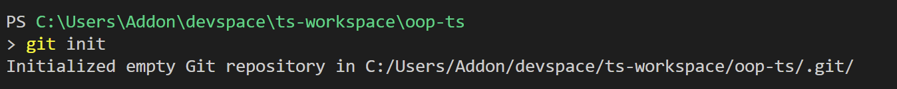
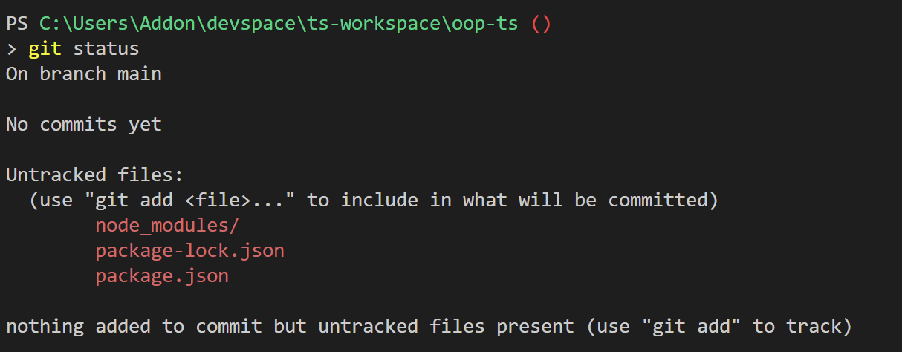
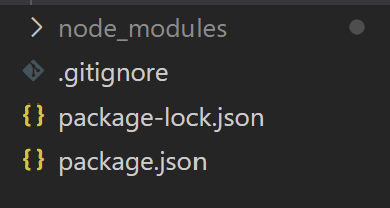
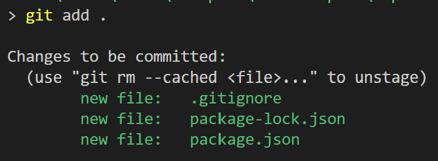
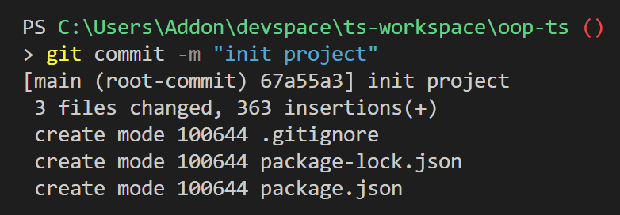

# Git

## Initialiser

Pour initialiser git:

```cmd
git init
```



On peut faire

```cmd
git status
```

Pour vérifier que le projet a bien été initialisé.



## .gitignore

À la racine du projet, on crée un fichier nommé `.gitignore`, dedans on écrit:

```git
node_modules
```

En faisant ça, on demande à git d'ignorer tout le dossier node_modules, qui correspond aux modules qu'on  installé.

VSC grise normalement les dossiers ignorés.



On peut refaire un `git status` pour vérifier que le fichier node_modules a bien été ignoré.

## Commit

On va ajouter tous les fichiers mofifiés pour qu'ils soient pris en compte dans notre commit :

```cmd
git add .
```

(on utilise `.` pour dire "tout le répertoire", mais on pourrait spécifier juste un dossier, ou un fichier, ou plusieurs)



Pour prendre une photo à l'instant T, on fait un commit:

```cmd
git commit -m "Initial commit"
```

Entre quote on écrit le message de notre commit.



## Créer un branch et changer de branch

On peut créer une branch

```cmd
git branch nomDeLaBranch
```

Pour changer de branch

```cmd
git checkout nomDeLaBranch
```

Pour créer une nouvelle branch et se